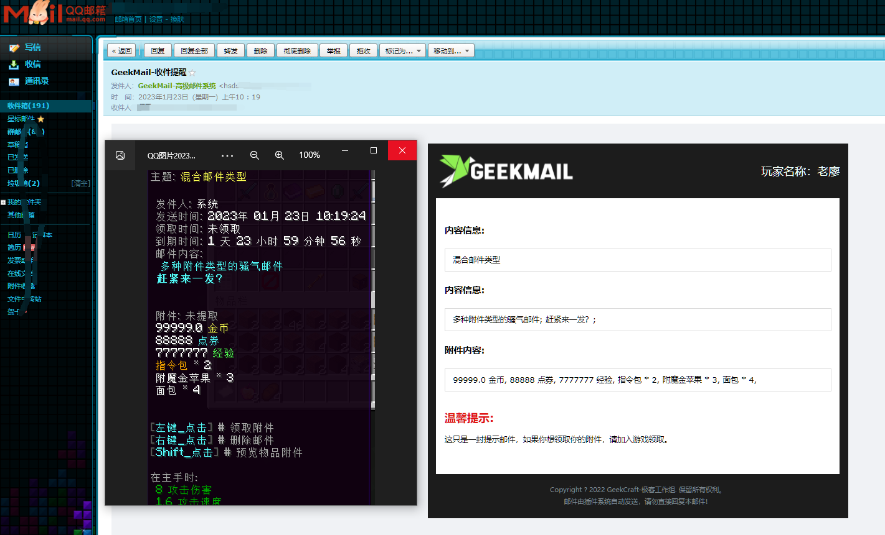
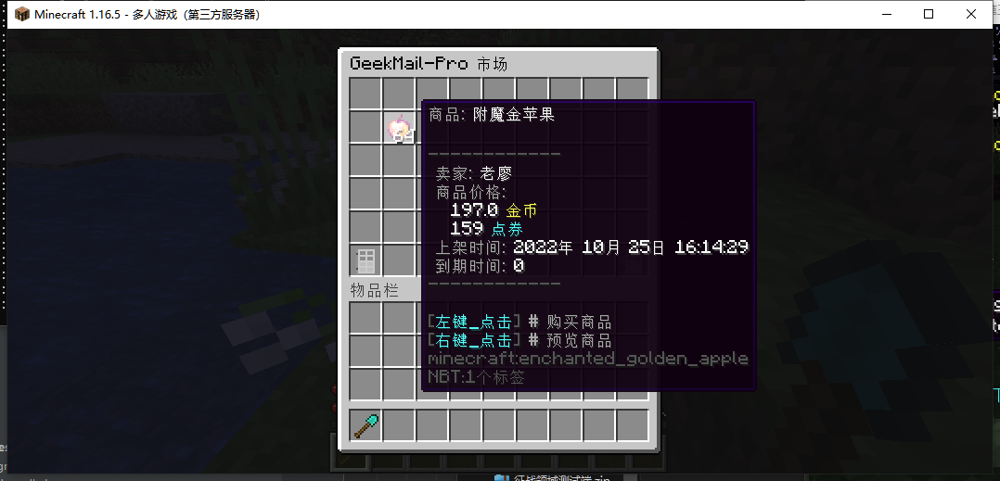
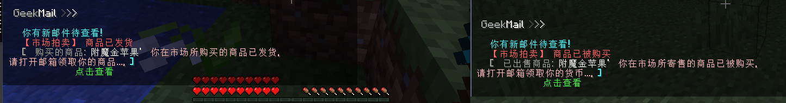
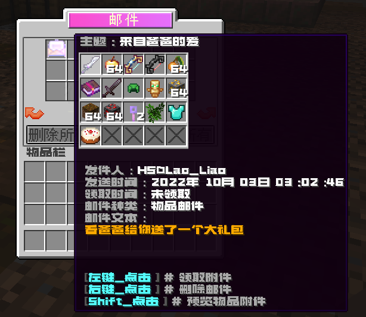
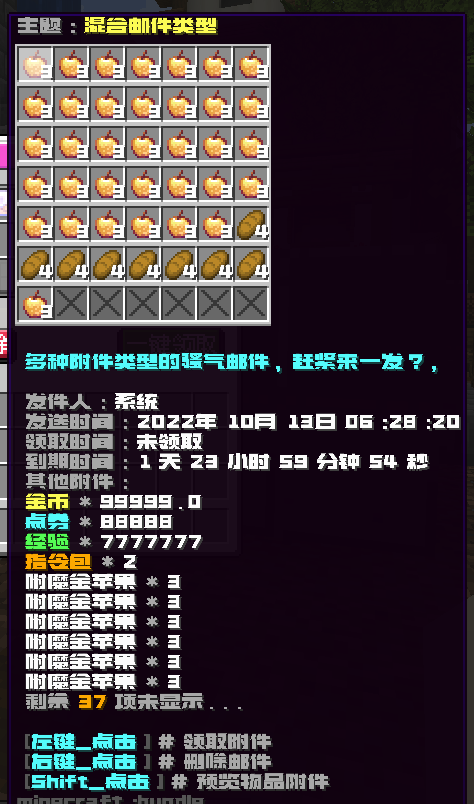

# 📬GeekMail-Pro  高级邮件系统 3.0
### ‼‼ 此版本大幅度修改，可能存在问题，请勿在生产环境使用，如有问题及时反馈。
### ‼‼ 如果你的版本低于 3.0 请勿更换插件，目前未准备好数据迁移工作
- **地表超强邮件系统**，**多模块**，**高端实用**，**支持邮件模板**，覆盖你能想到的所有邮箱功能 💯
- **公开售价:** **238** 元人民币
- **购买联系:** QQ1349517404 (回应迅速)
- **爱发电购买:** [点击前往](https://afdian.net/item?plan_id=e9f2a7a0172511edabfd52540025c377) 
- **BUG及功能建议:** [点击前往](https://github.com/liaojinmin/GeekMail-Pro/issues)

- 🎉楠木星球成员、TrMenu总部星球成员，**免费**
- 本插件 WIKI 不再免费公开,如果你通过自动构建获得插件，将不再得到作者支持！

注意: 你不得分发插件副本及其源码副本,此源码仅供参考,如果你愿意为此项目做出贡献，你会获得与付费购买者同样的待遇！


<br/>

---
## 💽兼容性

|  说明  |                           作用                            |
|:----:|:-------------------------------------------------------:|
| 支持版本 |                      1.12x - 1.19x                      |
| 可选依赖 | Vault、PlaceholderAPI、PlayerPoints、ItemsAdder、TrHologram |
| 数据储存 |                   Mysql、Sqlite、Redis                    |

<br/>

---
## 📒插件特色
- 📜基于 **Kotlin / Taboolib** 开发高端邮箱插件 - _(史无前例)_
- ❇️ **邮件模板** ❇️ 支持使用 **Kether** 脚本语言 - _(可控制玩家是否可见)_
- ❇️ **GUI界面** ❇️ 采用超高自由度配置，显示容器随意定义 - _(支持IA)_
- - ❇️ **邮件类型**  ❇️ 多种单列邮件类型 - _(包含混合邮件支持各种类型的东西混在一起)_
- - **物品邮件、指令邮件、点券邮件、金币邮件、经验邮件、纯文本邮件、全类型邮件(可混合以上多种附件)**
- -  每种邮件类型都可以单独设置显示的图标
- -  可通过API扩展更多的邮件类型，满足你的所有需求
- ❇️ **定制事件** ❇️ 设置可自动触发的发送事件 - _(触发事件自动将邮件发送给玩家)_
- ❇️ **邮箱方块** ❇️ 在服务器的任意一个角落设置一个邮箱？ - _(定点打开邮箱)_
- ❇️ **玩家鉴权** ❇️ 权限控制每种邮件的发送，玩家可互相邮寄物品 - _(使用模板自定义你的条件)_
- ❇️ **消息互动** ❇️ 支持使用任意消息互动 - _(全自定义消息种类音效)_
- ❇️ **SMTP服务** ❇️ 支持使用 SMTP 服务 发送邮件到玩家的QQ邮箱、网易邮箱 - _(邮件提醒支持离线)_
- ❇️ **ItemsAdder** ❇️ 使用ia自定义你的图标、物品和UI
- ❇️ **Redis跨服** ❇️ 使用 Redis服务器 进行多域跨服
- ❇️ **内置全球市场** ❇️ 依托邮件收发货的全球市场
- ❇️ **丰富的API接口** ❇️ 面向开发者的高扩展API

<br/>

---

# 🔊开发者API
**事件package** me.geek.mail.api.event
``` TEXT 
me.geek.mail.api.event.MailReceiveEvent  // 邮件接收事件
me.geek.mail.api.event.MailSenderEvent  // 邮件发送事件
me.geek.mail.api.event.WebMailSenderEvent // 真实邮件发送事件
me.geek.mail.api.event.NewPlayerJoinEvent  //新玩家加入事件
me.geek.mail.api.event.PlayerDataLoadEvent //玩家数据加载完成事件
```

```kotlin
import me.geek.mail.api.mail.MailManage
import org.bukkit.entity.Player
import java.util.UUID

/**
 * Kotlin 发送一封点券邮件
 * @param type 邮件种类
 * @param target 目标玩家UUID
 */
fun Player.sender(type: String = "MAIL_POINTS", target: UUID) {
    MailManage.getMailBuild(type, this, target).build {
        this.title = "new mail"
        this.text = "hello"
        this.additional = "100"
    }
}
```


# 🔆更多图片展示
### 与外部邮箱互动


### 内置的全球市场



### 1.17+ 物品类型预览


### ItemsAdder支持


### 上线提醒


### 附件领取

